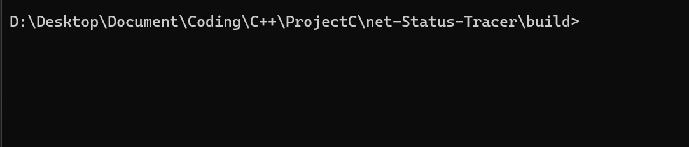

English | [简体中文](README.md)

# why NST

+ Visiable
+ Simple
+ Easy to Use
+ ...



## Usage

donwload and run is all your need, with full gcc runtime.

```bash
git clone github.com/GYPpro/net-status-tarcer
./nst
```

## what's more

(after `ln` with commend `nst`)

```bash
nst [ip] [timeout per loop] [max hisory length]
```

initially ip is 8.8.8.8, 1s timedout per loop and history length for 40

