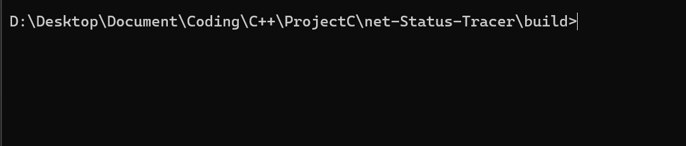

[English](README_EN.md) | 简体中文

# 为什么要写 NST

作为一个`Ubuntu`选手，自带的`ping`在持续监控网络状态时，输出的信息太多，不够直观。时快时慢的输出也会让人感到不适。

NST 只是把`ping`套了个多线程的壳，让它所呈现的信息更能满足**持续地监控网络状态**这一需求。



## 使用方法

下载并运行即可。

```bash
git clone github.com/GYPpro/net-status-tarcer
./nst
```

## 更多

(在`nst`命令后)

```bash
nst [ip] [timeout per loop] [max hisory length]
```

默认：
+ `ip`是`8.8.8.8`
+ 每次循环的超时时间是`1s`
+ 历史记录的最大长度是`40`
   
## 编译

```bash
cmake .. -G "MinGW Makefiles" -DCMAKE_C_COMPILER=gcc -DCMAKE_CXX_COMPILER=g++
```

